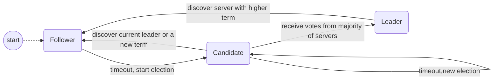

# Raft算法总结
## 概念
* term：（任期）以选举（election）开始，然后就是一段或长或短的稳定工作期，任期ID是递增的，每个任期的时间是随机的
* role：角色，server的状态

## 角色
raft算法中有三种角色：
* Leader: 处理所有客户端交互，日志复制等，一般一次只有一个Leader.
* Follower: 类似选民，完全被动
* Candidate: 类似Proposer律师，可以被选为一个新的领导人。 
选举的主要目的就是选出一个Leader

## 角色转换


## 选举过程详解
### Follower
* 每个节点的启动初始状态都是follower
* follower超过一段时间未收到leader的ping消息就会转换为candidate，任期ID加一，任期时长随机
### Leader
* 定期给所有的follower发送ping消息，证明自己的存在
* 发现任期id比自己高的节点就会变为follower
### Candidate
* 首先给自己投一票，然后找所有人投票
* 收到大部分server的选票之后会转换为leader，然后广播给所有的server
* 任期内未选出或找到新的leader，则开启下一个term继续选

## 测试样例代码
        测试样例代码采用三个节点，golang编写，代码如下
```golang
package main

import (
	"fmt"
	"math/rand"
	"net/http"
	"os"
	"strconv"
	"time"
)

const (
	follower  int32 = 1
	candidate int32 = 2
	leader    int32 = 3
)

var currentTerm int64
var leaderId string
var broadcastTime int64 = 1
var termTimeout int64
var role int32

func Now() int64 {
	now := time.Now().UnixNano() / (1000 * 1000 * 1000)
	fmt.Println("now: ", now)
	return now
}

func GenElectionTimeout() int64 {
	t := int64(rand.Intn(10) + 5)
	fmt.Println("ElectionTimeout: ", t)
	return t
}

func PingHandler(w http.ResponseWriter, r *http.Request) {
	fmt.Println("handle ping")
	term_str := r.URL.Query()["term"][0]
	term, _ := strconv.ParseInt(term_str, 10, 64)
	if term >= currentTerm {
		currentTerm = term
		role = follower
		termTimeout = Now() + GenElectionTimeout()
	}
	w.WriteHeader(200)
}

func VoteHandler(w http.ResponseWriter, r *http.Request) {
	fmt.Println("handle vote")
	term_str := r.URL.Query()["term"][0]
	term, _ := strconv.ParseInt(term_str, 10, 64)
	if term > currentTerm {
		w.WriteHeader(200)
	} else {
		w.WriteHeader(201)
	}

}

func InstallHandler(w http.ResponseWriter, r *http.Request) {
	fmt.Println("handle install")
	term_str := r.URL.Query()["term"][0]
	term, _ := strconv.ParseInt(term_str, 10, 64)
	if term > currentTerm {
		role = follower
		currentTerm = term
		w.WriteHeader(200)
	} else {
		w.WriteHeader(201)
	}
}

func Vote(host string, term int64) bool {
	fmt.Println("vote")
	url := fmt.Sprintf("http://127.0.0.1"+host+"/vote?term=%d", term)
	res, err := http.Get(url)
	if err != nil {
		fmt.Println(err.Error())
		return false
	}
	if res.StatusCode == 200 {
		return true
	} else {
		return false
	}
}

func Install(host string, term int64, node string) bool {
	fmt.Println("install")
	url := fmt.Sprintf("http://127.0.0.1"+host+"/install?term=%d&node=%d", term, node)
	res, err := http.Get(url)
	if err != nil {
		fmt.Println(err.Error())
		return false
	}
	if res.StatusCode == 200 {
		return true
	} else {
		return false
	}

}

func Ping(host string, term int64) bool {
	fmt.Println("ping")
	url := fmt.Sprintf("http://127.0.0.1"+host+"/ping?term=%d", term)
	res, err := http.Get(url)
	if err != nil {
		fmt.Println(err.Error())
		return false
	}
	if res.StatusCode == 200 {
		return true
	} else {
		return false
	}

}

func main() {
	currentTerm = 0
	leaderId = ""
	role = follower
	termTimeout = Now() + GenElectionTimeout()
	http.HandleFunc("/ping", PingHandler)
	http.HandleFunc("/vote", VoteHandler)
	http.HandleFunc("/install", InstallHandler)
	nodeId := os.Args[1]
	nodeMap := map[string]string{"1": ":9001", "2": ":9002", "3": ":9003"}
	go func(nodeId string, nodeMap map[string]string) {
		for {
			switch role {
			case follower:
				fmt.Println("follower")
				if Now() > termTimeout {
					role = candidate
					termTimeout = Now() + GenElectionTimeout()
					currentTerm++
				}
			case candidate:
				fmt.Println("candidate,term:", currentTerm)
				now := Now()
				if now > termTimeout {
					termTimeout = Now() + GenElectionTimeout()
					currentTerm++
				}
				voted := 1
				for id, host := range nodeMap {
					if id != nodeId {
						result := Vote(host, currentTerm)
						if result == true {
							voted++
						}
					}
				}
				if voted >= 2 {
					role = leader
					for id, host := range nodeMap {
						if id != nodeId {
							result := Install(host, currentTerm, nodeId)
							if result == true {
								voted++
							}
						}
					}
				}
			case leader:
				fmt.Println("leader")
				for id, host := range nodeMap {
					if id != nodeId {
						Ping(host, currentTerm)
					}
				}

			}
			time.Sleep(1 * 1000 * 1000 * 1000)
		}

	}(nodeId, nodeMap)
	err := http.ListenAndServe(nodeMap[nodeId], nil)
	if err != nil {
		fmt.Println(err.Error())
		return
	}
}
```